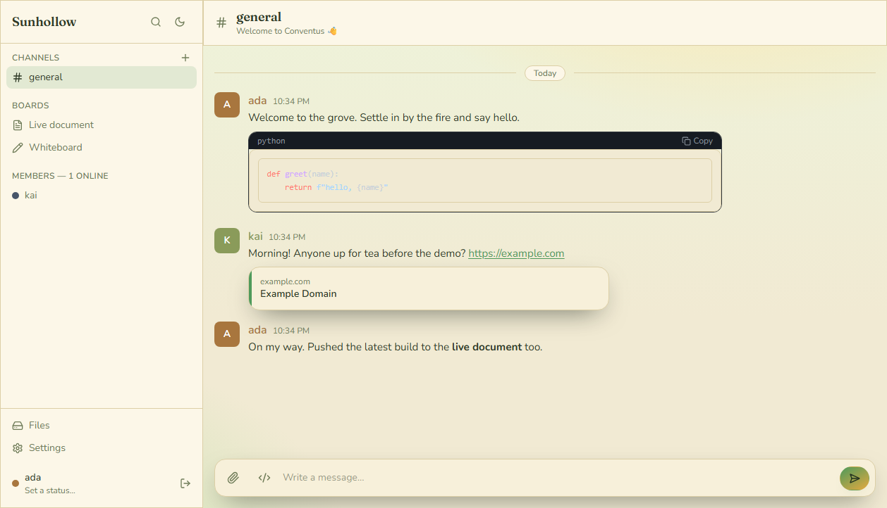
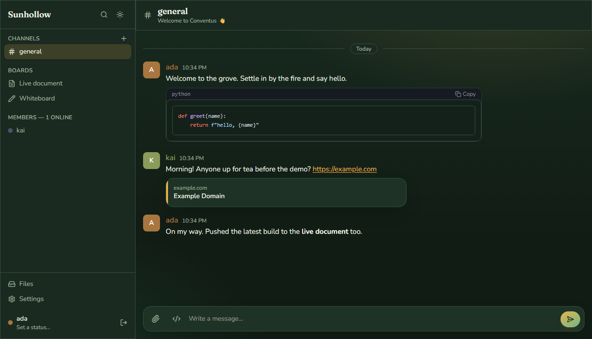

# Conventus

An **ephemeral, self-hostable, Slack-like room** you can spin up in seconds and
throw away just as fast. One Docker container, a single shared password, and a
warm **solarpunk · Ghibli** design — drop it on a Hugging Face Space (or
anywhere that runs Docker) for a hackathon, a workshop, or a weekend, then
delete it.

> *Conventus* — Latin for "a gathering, an assembly."

<p align="center">
  
</p>

<p align="center">
  <sub>Realtime chat, collaborative boards, bots, and a Files drive — in a single container. Also ships a dark <em>“Forest dusk”</em> theme.</sub>
</p>

<p align="center">
  <a href="#quick-start">Quick start</a> ·
  <a href="#features">Features</a> ·
  <a href="#configuration">Configuration</a> ·
  <a href="#automation-api">Automation API</a> ·
  <a href="#documentation">Docs</a>
</p>

<p align="center">
  
  
  
  
</p>

## Features

**Chat**
- 🔑 **One room password.** People pick a name (or claim a reserved one) and they're in. No accounts, no email, no secrets.
- 💬 **Channels + DMs** in realtime over WebSockets, with presence and typing indicators.
- ✍️ **Rich messages** — edit, delete, **emoji reactions**, **quote-replies**, **pinned messages**, **permalinks**, and `/slash` commands (`/me`, `/shrug`, `/poll`, `/dm`, `/theme`, `/topic`, `/help`, …) with an autocomplete palette.
- 🔎 **Message search** across channels and your DMs (⌘/Ctrl-K), and date dividers.
- 🖋️ **Markdown** — headings, lists, blockquotes, **tables**, syntax-highlighted **code blocks**, and sandboxed **HTML widgets**.
- 🙋 **Presence + status** — set a status (emoji + text); reserved names; admins manage channels, members and bots.
- 🗂️ **Folders** — group channels and boards into collapsible folders (drag-and-drop), shared across the room.

**Media**
- 📎 **Rich sharing** — images, audio, video (incl. inline **WebM/MP4/GIF**), files, and **auto link previews** (OpenGraph, with inline players for media links). **Drag-and-drop** anywhere to share.
- 🖼️ **Image lightbox** and a **Files / Drive** view of everything uploaded, with **in-app previews** — images, rendered **markdown**, plain text/code, **PDFs**, and audio/video open in a modal without leaving the room.

**Collaboration** *(Yjs CRDT — boards live under the channels list, created from the **+** menu)*
- 📝 **Live documents** — shared markdown scratchpads with live preview, **multiple named** boards, **live remote cursors**, and one-click **download as Markdown or PDF**.
- 🎨 **Collaborative whiteboards** — freehand drawing with colors and brush sizes, **images you can move, resize and rotate**, **zoom & pan**, a Minecraft-style **tool hotbar**, **comment pins that @tag people**, and live remote cursors.
- 📋 **Kanban boards** — columns and cards you can drag between lists, viewable as a **board, table, or list**. Cards carry **images, keywords, an assignee, a due date, and a link**.

**Bots & automation**
- 🤖 **Bots** — wire up any **OpenAI-compatible** endpoint and let an agent live in a channel (reply on @mention or every message), with **streaming** replies and avatars.
- 🧰 **Automation API** — the same password-protected REST API powers bots, scripts, and scheduled posts.

**Look & feel**
- 🌿 **Solarpunk · Ghibli design** — warm sunlit palette, storybook type, illustrated login + empty states.
- 🌗 **Light & dark themes** (forest-dusk / meadow-day) plus per-user **custom CSS** (stored only in your browser) and solarpunk presets.
- 🔔 **@mention notifications** (desktop + title badge), and an offline/reconnecting indicator.

**Mobile**
- 📱 **Responsive + installable** — works great on phones (bottom tab bar, touch-friendly actions, safe-area aware) and installs as a **PWA** ("Add to Home Screen") with an offline-capable app shell.

**Operations**
- 📦 **Export / Import** — snapshot the entire room (messages + files + bots + members) to one zip and rehydrate later.

## Quick start

### Docker (recommended)

```bash
docker compose up --build
# open http://localhost:7860   (room password: "conventus", admin: "admin")
```

Or plain Docker:

```bash
docker build -t conventus .
docker run -p 7860:7860 \
  -e ROOM_PASSWORD=letmein -e ADMIN_PASSWORD=s3cr3t -e SECRET_KEY=$(openssl rand -hex 32) \
  -v conventus-data:/data conventus
```

### Hugging Face Spaces

1. Create a new Space → **Docker** SDK (blank).
2. Push this repo to it. The GitHub Action prepends `hf-space-header.yml` to
   the README before syncing so the Space gets `sdk: docker` and `app_port: 7860`.
3. Set `ROOM_PASSWORD`, `ADMIN_PASSWORD` and `SECRET_KEY` as **Space secrets**.
4. (Optional) Enable **persistent storage** so the room survives restarts — it mounts at `/data`.

## Configuration

All via environment variables (see `.env.example`):

| Variable        | Default      | Purpose                                   |
| --------------- | ------------ | ----------------------------------------- |
| `ROOM_PASSWORD` | `conventus`  | Shared password to enter the room         |
| `ADMIN_PASSWORD`| `admin`      | Unlocks the admin panel                   |
| `SECRET_KEY`    | random       | Signs session tokens (pin for stability)  |
| `ROOM_NAME`     | `Conventus`  | Branding in the UI                        |
| `MAX_UPLOAD_MB` | `100`        | Per-file upload limit                     |
| `DATA_DIR`      | `/data`      | DB + uploads location                     |
| `PORT`          | `7860`       | HTTP port                                 |

## Local development

Two terminals (hot reload for both):

```bash
# backend
cd backend
pip install -r requirements.txt
uvicorn app.main:app --reload --port 7860

# frontend (proxies /api and /ws to :7860)
cd frontend
npm install
npm run dev      # http://localhost:5173
```

## Automation API

Authenticate once, then post anywhere with the bearer token:

```bash
URL=http://localhost:7860
TOKEN=$(curl -s $URL/api/auth/login -H 'content-type: application/json' \
  -d '{"password":"conventus","name":"poster"}' | jq -r .token)

curl $URL/api/channels/1/messages -X POST \
  -H "Authorization: Bearer $TOKEN" -H 'content-type: application/json' \
  -d '{"content":"Hello from the API 🚀"}'
```

Interactive docs are served at `/docs` (FastAPI / Swagger).

## Architecture

```
┌─────────────────────────── single container ───────────────────────────┐
│  FastAPI (uvicorn) ── REST + WebSocket ── SQLite (WAL) + files on disk   │
│         │              │                                                 │
│         │              └── Yjs collab relay (docs · whiteboards · kanban)  │
│         └── serves the built React/Vite SPA (Tailwind) as static         │
└─────────────────────────────────────────────────────────────────────────┘
```

- **Backend** — `backend/app`: routers (auth, channels, dms, messages, search, boards, files, bots, members, admin), a WebSocket presence/fan-out hub, a persistent Yjs collab relay (with log compaction), and link-preview + streaming-bot engines. SQLite in WAL mode; nothing external to run.
- **Frontend** — `frontend/src`: React + Zustand + Tailwind v4, a reconnecting WebSocket, and Yjs for the collaborative boards (live documents, whiteboards, kanban). No accounts — just a signed session token from the room password.

## Theming

Two built-in themes — **Meadow day** (light) and **Forest dusk** (dark) — toggle from the sidebar, plus per-user **custom CSS** stored only in your browser. The whole UI is driven by CSS design tokens, so a few variables restyle everything.

<p align="center">
  
</p>

See [DESIGN.md](DESIGN.md) for the token reference and five alternative palettes (Midnight Glass, Terminal, Neo-Brutalist, Sakura Day, Deep Ocean), and the [theming guide](docs/content.md) for step-by-step custom CSS.

## Documentation

- **[Feature tour & API reference](docs/content.md)** — the illustrated docs (renders on GitHub; also built to a self-contained `docs/index.html`).
- **[DEPLOY.md](DEPLOY.md)** — deploying to Hugging Face Spaces and elsewhere.
- **[DESIGN.md](DESIGN.md)** — the design system, tokens, and alternative palettes.
- **[AGENTS.md](AGENTS.md)** — contributor guide: architecture, build/run/test workflow, and gotchas.
- **Interactive API** — Swagger UI at `/docs`, ReDoc at `/redoc` on a running instance.

## License

[MIT](LICENSE) — do whatever; it's meant to be disposable.
