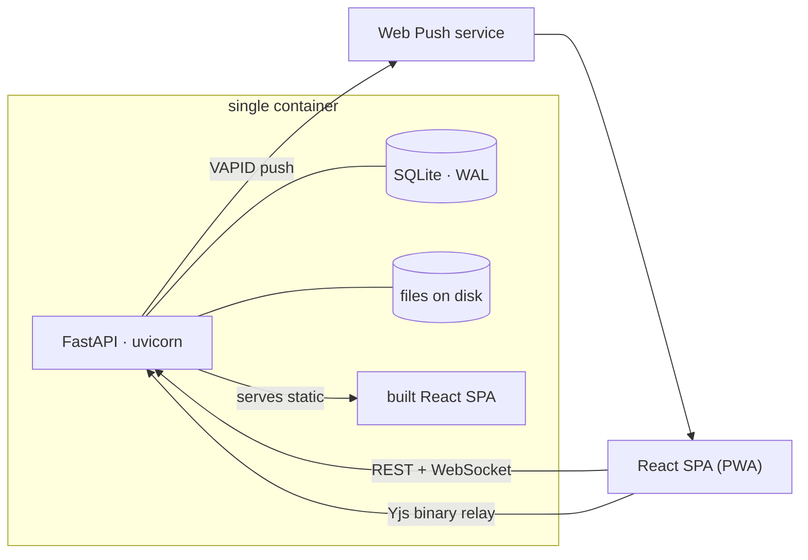
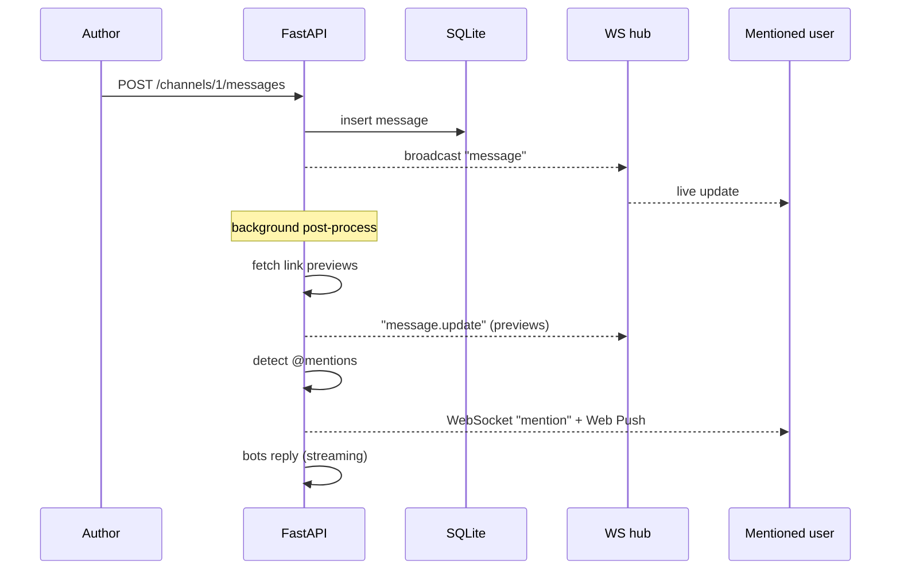
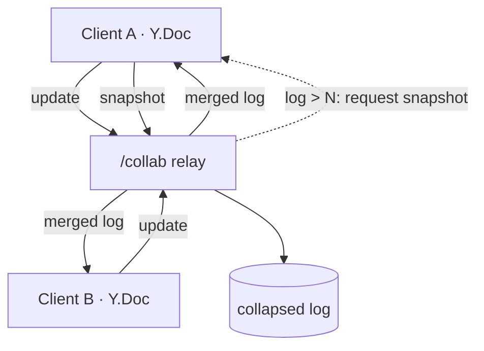

# 🌿 Conventus

**An ephemeral, self-hostable, Slack-like room.** One Docker container, a single
shared password, a warm *solarpunk · Ghibli* design — drop it on a Hugging Face
Space (or anywhere that runs Docker) for a hackathon, a workshop, or a weekend,
then delete it.

> *Conventus* — Latin for *“a gathering, an assembly.”*


---

## Why

During a hackathon you often want a shared, real-time space for a few hours —
but spinning up Slack/Discord is heavyweight and permanent. Conventus is the
opposite: **no accounts, no email, no retention guarantees.** One password lets
people in; they pick a name and start talking, sharing files, drawing on a
shared whiteboard, and wiring up bots. When you're done, you delete the
container and it's gone.

- **Single container.** FastAPI serves a React SPA, talks WebSockets, and stores
  everything in SQLite + files on disk. Nothing external to run.
- **One name + one password** to enter. The password can be the room password,
  the admin password, or a reserved-name password.
- **Ephemeral by design** — snapshot to a zip and rehydrate later if you want.

---

## Features

### 💬 Chat
- **Channels + DMs** in realtime over WebSockets, with presence and typing indicators.
- **Rich messages** — edit, delete, **emoji reactions**, **quote-replies**, **pinned messages**, **permalinks**, and **date dividers**.
- **Slash commands** with an autocomplete palette: `/me`, `/shrug`, `/tableflip`, `/poll`, `/dm`, `/theme`, `/topic`, `/help`, …
- **Message search** across channels and your DMs (`⌘/Ctrl-K`).
- **Custom avatars & status** — set an emoji/image avatar and a status line.
- **Protect your name** — claim your name with a personal password from Settings, so nobody else can log in as you with just the room password.


### 🖋️ Markdown
Headings, lists, blockquotes, **tables**, syntax-highlighted **code blocks**, and
sandboxed **HTML widgets** — shared by chat and the collaborative canvas.


### 📎 Media
Images, audio, video (incl. inline **WebM / MP4 / GIF**), files, and **auto link
previews** (OpenGraph, with inline players for media links). **Drag-and-drop**
anywhere to share, an **image lightbox**, and a **Files / Drive** view with
**in-app previews** — images, rendered markdown, plain text/code, PDFs, and
audio/video open in a modal without leaving the room.


### 📝 Real-time collaboration (Yjs CRDT)
Boards live right under the channels list; the **+** next to *Channels* opens a
menu to spin up any of three kinds (or a **folder** to organize them — drag
channels and boards into collapsible folders, shared across the room):
- **Live documents** — shared markdown scratchpads with live preview,
  **multiple named** boards, **live remote cursors**, and one-click
  **download as Markdown or PDF**.
- **Collaborative whiteboards** — freehand drawing with colors and brush
  sizes, **images you can move, resize and rotate**, **zoom & pan**, a
  Minecraft-style **tool hotbar** (keys 1–6), **comment pins that @tag
  people**, and live remote cursors.
- **Kanban boards** — columns and cards you can drag between lists, viewable as
  a **board, table, or list**. Each card carries an **image, keywords, an
  assignee, a due date, and a link**, edited from a card-detail panel.


### 🤖 Bots & automation
- **Bots** — wire up any **OpenAI-compatible** endpoint and let an agent live in
  a channel (reply on @mention or every message), with **streaming** replies and
  avatars, editable from the admin panel.
- **Automation API** — the same password-protected REST API powers bots,
  scripts, and scheduled posts.


### 🔔 Notifications
**@mention notifications** — desktop + a title-bar badge while the tab is open,
and **Web Push** (via a service worker + VAPID) so subscribers are notified even
when the app is closed. Plus an offline / reconnecting indicator.


### 🎨 Look & feel
A **solarpunk · Ghibli** design — warm sunlit palette, storybook type, an
illustrated login scene and empty states. **Light & dark themes** plus per-user
**custom CSS** (stored only in your browser) and solarpunk presets.


### 📱 Mobile + installable
Fully responsive — a bottom tab bar, touch-friendly actions, safe-area aware —
and **installable as a PWA** (“Add to Home Screen”) with an offline-capable app
shell.


---

## Make it yours — theming & custom CSS

Conventus is built on a small set of CSS variables, so you can restyle it
completely — **for yourself**. Open **Settings → Appearance** and write CSS in
the **Custom CSS** box. It's stored only in your browser's `localStorage` (never
sent to the server), applied live as you type, and it **overrides the active
light/dark theme**, so your tweaks always win.

### Design tokens

Override any of these on `:root`:

| Variable          | Controls                                   |
| ----------------- | ------------------------------------------ |
| `--c-bg`          | App background                             |
| `--c-surface`     | Sidebar / headers                          |
| `--c-surface-2`   | Cards, the composer                        |
| `--c-elevated`    | Buttons, hovered rows                      |
| `--c-border`      | Borders / dividers                         |
| `--c-text`        | Primary text                               |
| `--c-muted`       | Secondary text                             |
| `--c-accent`      | Primary accent (buttons, links, mentions)  |
| `--c-accent-2`    | Secondary accent (gradients)               |
| `--c-accent-soft` | Translucent accent (highlights)            |
| `--c-hover`       | Row-hover overlay                          |
| `--radius`        | Corner roundness                           |
| `--font`          | Body font                                  |
| `--font-display`  | Heading / brand font                       |

### Examples

A punchy orange accent and tighter corners:

```css
:root {
  --c-accent: #ff7a00;
  --c-accent-2: #ffb347;
  --radius: 6px;
}
```

A whole custom palette:

```css
:root {
  --c-bg: #0b0e14;
  --c-surface: #11151f;
  --c-surface-2: #161b27;
  --c-elevated: #1d2433;
  --c-border: #2a3142;
  --c-text: #e8ecf5;
  --c-muted: #8a93a6;
  --c-accent: #7c9cff;
  --c-accent-2: #b08cff;
  --c-accent-soft: #7c9cff2b;
}
```

Custom CSS isn't limited to the tokens — you can target any element, and even
pull in a web font:

```css
@import url("https://fonts.googleapis.com/css2?family=Space+Grotesk&display=swap");
:root { --font: "Space Grotesk", sans-serif; }

.msg-content { font-size: 0.98rem; line-height: 1.7; }
```

> Want a starting point? **Settings → Appearance** ships presets — *Forest Dusk,
> Meadow Day, Golden Hour, Mossy Glen, Sakura, Twilight* — plus a one-click
> **light / dark** toggle. Custom CSS layers on top of whichever you pick.

---

## Architecture

Everything lives in **one container**: FastAPI (uvicorn) serves the JSON API, a
realtime WebSocket, a Yjs collaboration relay, and the built React/Vite SPA as
static files. State is SQLite (WAL) plus uploaded files on disk.



### Message lifecycle

Posting a message broadcasts immediately, then post-processes (link previews,
mentions, bots) and broadcasts updates — so the UI feels instant.



### Collaboration & CRDT compaction

Live documents, whiteboards and kanban boards are Yjs documents. The server is a **persistent relay**:
it stores an append-only log of binary updates and fans them out. When the log
grows past a threshold it asks a client for a full **snapshot** and collapses the
log to a single update, keeping late-joiner sync fast.



---

## Tech stack

| Layer        | Tech                                                                   |
| ------------ | ---------------------------------------------------------------------- |
| Frontend     | React 18, Vite, TypeScript, Tailwind v4, Zustand, Yjs, highlight.js    |
| Backend      | FastAPI, uvicorn, SQLite (WAL), itsdangerous, httpx, BeautifulSoup     |
| Realtime     | WebSockets (presence/messages) + a binary Yjs relay (collab)           |
| Notifications| Web Push (pywebpush + VAPID), a service worker                         |
| Packaging    | Multi-stage Docker (Vite build → FastAPI serves the static SPA)        |

---

## Run it

### Docker

```bash
docker compose up --build
# open http://localhost:7860   (room password: "conventus", admin: "admin")
```

### Hugging Face Spaces

1. Create a new Space → **Docker** SDK.
2. Push this repo. The `app_port: 7860` front matter in the root `README.md` is
   all the config the Space needs.
3. Set `ROOM_PASSWORD`, `ADMIN_PASSWORD` and `SECRET_KEY` as **Space secrets**.
4. (Optional) Enable **persistent storage** so the room survives restarts — it
   mounts at `/data`.

### Configuration

| Variable        | Default     | Purpose                                  |
| --------------- | ----------- | ---------------------------------------- |
| `ROOM_PASSWORD` | `conventus` | Shared password to enter the room        |
| `ADMIN_PASSWORD`| `admin`     | Unlocks the admin panel                  |
| `SECRET_KEY`    | random      | Signs session tokens (pin for stability) |
| `ROOM_NAME`     | `Conventus` | Branding in the UI                       |
| `MAX_UPLOAD_MB` | `100`       | Per-file upload limit                    |
| `DATA_DIR`      | `/data`     | DB + uploads location                    |

---

## API reference

Everything the UI does is a documented REST call, so bots, scripts and
scheduled posts use the same surface. **Interactive docs** are served live at
**`/docs`** (Swagger UI) and **`/redoc`**; the raw schema is at `/openapi.json`.

### Authentication

All endpoints except `GET /api/health`, `GET /api/auth/config`,
`POST /api/auth/login` and `GET /api/push/config` need a **bearer token**.
Get one, then send it on every request:

```bash
URL=http://localhost:7860
TOKEN=$(curl -s $URL/api/auth/login -H 'content-type: application/json' \
  -d '{"password":"conventus","name":"poster"}' | jq -r .token)

# Post a message
curl $URL/api/channels/1/messages -X POST \
  -H "Authorization: Bearer $TOKEN" -H 'content-type: application/json' \
  -d '{"content":"Hello from the API 🚀"}'
```

Use the admin password in the same `"password"` field to get an **admin** token
(required by the admin-only endpoints marked 🔒).

### Endpoints

**Auth**

| Method & path           | Body / notes                                   |
| ----------------------- | ---------------------------------------------- |
| `POST /api/auth/login`  | `{password, name}` → `{token, user}`. Password may be room, admin, or reserved-name password. |
| `GET  /api/auth/me`     | Current user                                   |
| `POST /api/auth/protect` | `{password}` — protect your own name with a personal password (login then requires it). Empty password removes the protection. |
| `GET  /api/auth/config` | Public: room name + version (no auth)          |

**Channels & messages**

| Method & path                          | Body / notes                          |
| -------------------------------------- | ------------------------------------- |
| `GET    /api/channels`                 | List channels                         |
| `POST   /api/channels`                 | `{name, topic?}`                      |
| `PATCH  /api/channels/{id}` 🔒         | `{name?, topic?}`                     |
| `DELETE /api/channels/{id}` 🔒         | (not the default channel)             |
| `GET    /api/channels/{id}/messages`   | `?before=&limit=` (paginated)         |
| `POST   /api/channels/{id}/messages`   | `{content, attachments?, reply_to?}`  |
| `GET    /api/channels/{id}/pins`       | Pinned messages                       |
| `PATCH  /api/messages/{id}`            | Edit own message `{content}`          |
| `DELETE /api/messages/{id}`            | Author or admin                       |
| `POST   /api/messages/{id}/reactions`  | Toggle `{emoji}`                      |
| `POST   /api/messages/{id}/pin`        | Toggle pinned                         |

**DMs**

| Method & path                     | Body / notes                  |
| --------------------------------- | ----------------------------- |
| `GET  /api/dms`                   | Your conversations            |
| `POST /api/dms`                   | `{with}` → open/get a DM      |
| `GET  /api/dms/{id}/messages`     | `?before=&limit=`             |
| `POST /api/dms/{id}/messages`     | `{content, attachments?, reply_to?}` |

**Members · search · boards · files**

| Method & path                  | Body / notes                                  |
| ------------------------------ | --------------------------------------------- |
| `GET  /api/members`            | Roster with presence, status, avatar          |
| `POST /api/members/status`     | `{status}`                                    |
| `POST /api/members/avatar`     | `{avatar}` (emoji or URL)                     |
| `GET  /api/search?q=`          | Search channels + your DMs                    |
| `GET  /api/boards`             | List boards (live documents, whiteboards, kanban) |
| `POST /api/boards`             | `{kind, name}` (`canvas`/`whiteboard`/`kanban`) |
| `PATCH /api/boards/{id}`       | `{name}`                                       |
| `DELETE /api/boards/{id}` 🔒   | Removes the board + its collab log            |
| `POST /api/files`              | multipart `file=` → metadata                  |
| `GET  /api/files`              | The Drive listing                             |
| `GET  /api/files/{id}/raw`     | Stream a file (`?download=true` to download)  |
| `DELETE /api/files/{id}`       | Uploader or admin                             |

**Bots · push · admin**

| Method & path                  | Body / notes                                  |
| ------------------------------ | --------------------------------------------- |
| `GET  /api/bots`               | List bots (keys masked)                       |
| `POST /api/bots` 🔒            | `{name, base_url, api_key?, model, system_prompt?, trigger, channels?, avatar?}` |
| `PATCH /api/bots/{id}` 🔒      | Any of the above (blank `api_key` keeps it)   |
| `DELETE /api/bots/{id}` 🔒     | Delete a bot                                  |
| `GET  /api/push/config`        | VAPID public key (no auth)                    |
| `POST /api/push/subscribe`     | `{subscription}`                              |
| `POST /api/push/unsubscribe`   | `{endpoint}`                                  |
| `POST /api/admin/reserve` 🔒   | `{name, password, is_admin?}`                 |
| `DELETE /api/admin/members/{name}` 🔒 | Remove a member                        |
| `POST /api/admin/export` 🔒    | Download the room as a zip                    |
| `POST /api/admin/import` 🔒    | multipart `file=` (a previous export)         |

> 🔒 = requires an admin token. The same token authorizes the realtime
> `/ws?token=…` (presence + messages) and `/collab/{doc}?token=…` (Yjs) sockets.

---

*Built as a disposable, joyful little gathering place. MIT licensed — do whatever.* 🌿
