# 🌿 Conventus

**An ephemeral, self-hostable, Slack-like room.** One Docker container, a single
shared password, a warm *solarpunk · Ghibli* design — drop it on a Hugging Face
Space (or anywhere that runs Docker) for a hackathon, a workshop, or a weekend,
then delete it.

> *Conventus* — Latin for *“a gathering, an assembly.”*

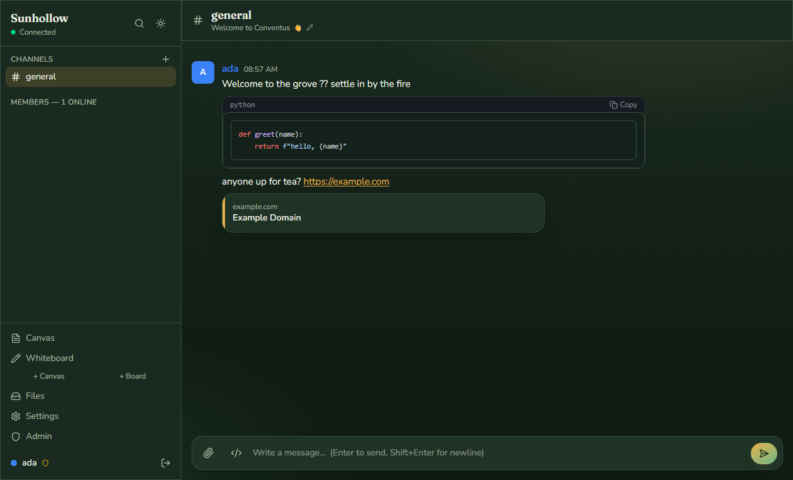
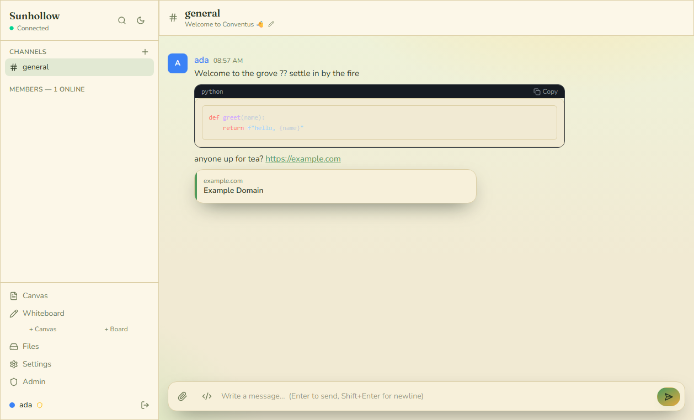

---

## Why

During a hackathon you often want a shared, real-time space for a few hours —
but spinning up Slack/Discord is heavyweight and permanent. Conventus is the
opposite: **no accounts, no email, no retention guarantees.** One password lets
people in; they pick a name and start talking, sharing files, drawing on a
shared whiteboard, and wiring up bots. When you're done, you delete the
container and it's gone.

- **Single container.** FastAPI serves a React SPA, talks WebSockets, and stores
  everything in SQLite + files on disk. Nothing external to run.
- **One name + one password** to enter. The password can be the room password,
  the admin password, or a reserved-name password.
- **Ephemeral by design** — snapshot to a zip and rehydrate later if you want.

---

## Features

### 💬 Chat
- **Channels + DMs** in realtime over WebSockets, with presence and typing indicators.
- **Rich messages** — edit, delete, **emoji reactions**, **quote-replies**, **pinned messages**, **permalinks**, and **date dividers**.
- **Slash commands** with an autocomplete palette: `/me`, `/shrug`, `/tableflip`, `/poll`, `/dm`, `/theme`, `/topic`, `/help`, …
- **Message search** across channels and your DMs (`⌘/Ctrl-K`).
- **Custom avatars & status** — set an emoji/image avatar and a status line.
- **Protect your name** — claim your name with a personal password from Settings, so nobody else can log in as you with just the room password.
- **Room announcements** — new channels and boards (and game wins) are
  announced as friendly chips in the main channel, so nothing shared goes
  unnoticed. There is always a main channel.

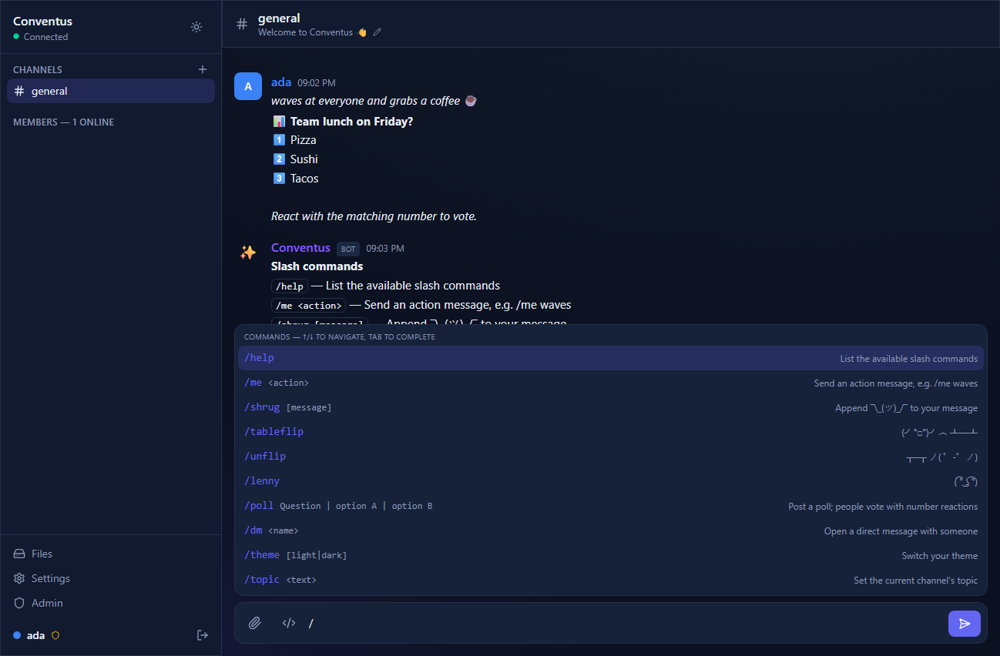
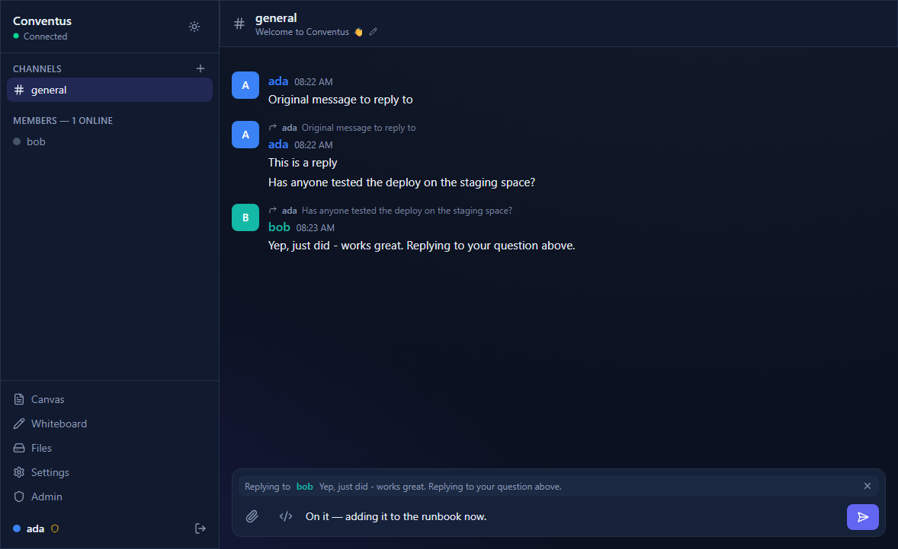

### 🖋️ Markdown
Headings, lists, blockquotes, **tables**, syntax-highlighted **code blocks**, and
sandboxed **HTML widgets** — shared by chat and the collaborative canvas.

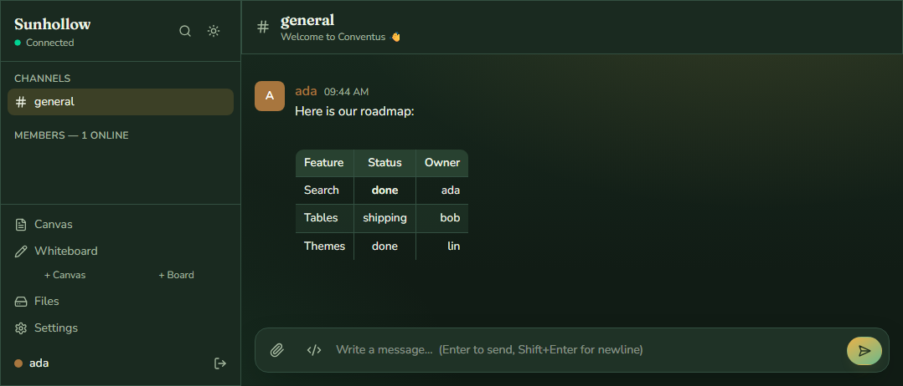
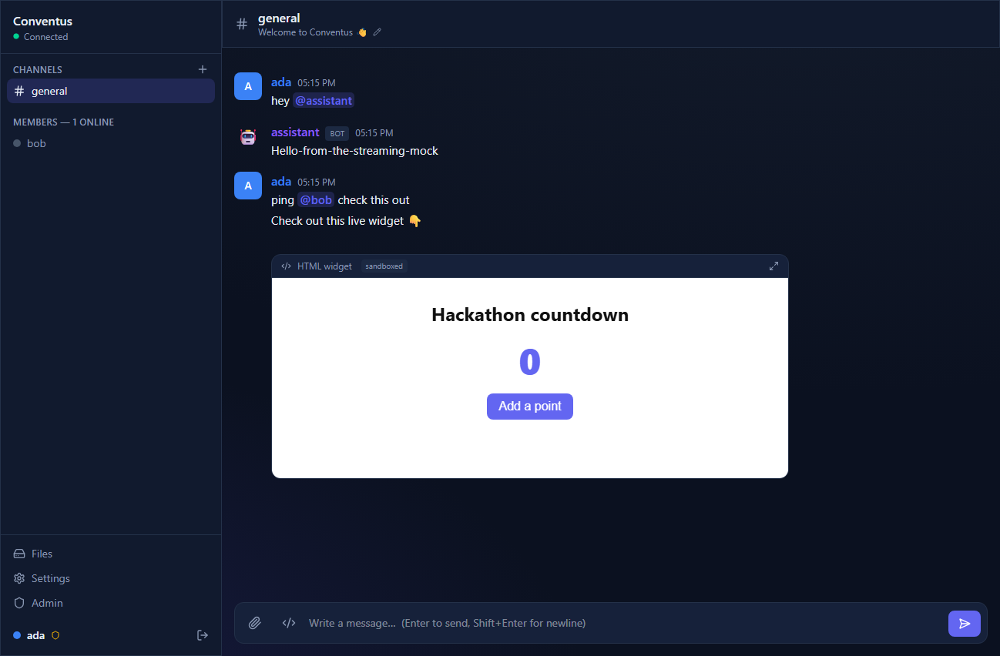

### 📎 Media
Images, audio, video (incl. inline **WebM / MP4 / GIF**), files, and **auto link
previews** (OpenGraph, with inline players for media links). **Drag-and-drop**
anywhere to share, an **image lightbox**, and a **Files / Drive** view with
**in-app previews** — images, rendered markdown, plain text/code, PDFs, and
audio/video open in a modal without leaving the room.

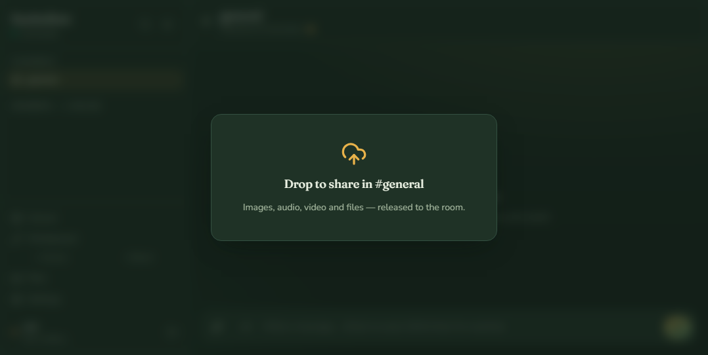
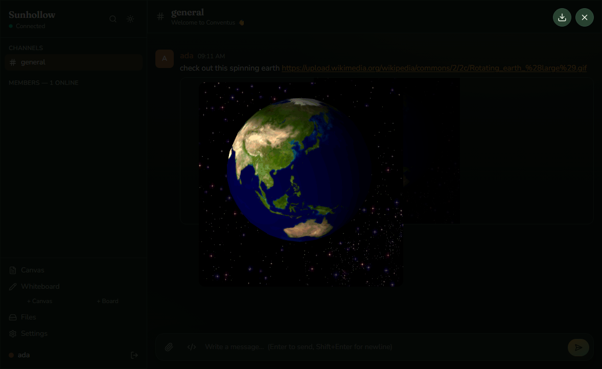

### 📝 Real-time collaboration (Yjs CRDT)
Boards live right under the channels list; the **+** next to *Channels* opens a
menu to spin up a **folder** (to organize them — drag channels and boards into
collapsible folders, shared across the room) or any of **six** board kinds.
Three are collaborative CRDT surfaces; the others are a live **call room**, a
**game board**, and a shared **map** (each in its own section below):
- **Live documents** — shared markdown scratchpads with live preview,
  **multiple named** boards, **live remote cursors**, and one-click
  **download as Markdown or PDF**.
- **Collaborative whiteboards** — freehand drawing with colors and brush
  sizes, **images you can move, resize and rotate**, **zoom & pan**, a
  Minecraft-style **tool hotbar** (keys 1–6), **comment pins that @tag
  people**, and live remote cursors.
- **Kanban boards** — columns and cards you can drag between lists, viewable as
  a **board, table, or list**. Each card carries an **image, keywords, an
  assignee, a due date, and a link**, edited from a card-detail panel.

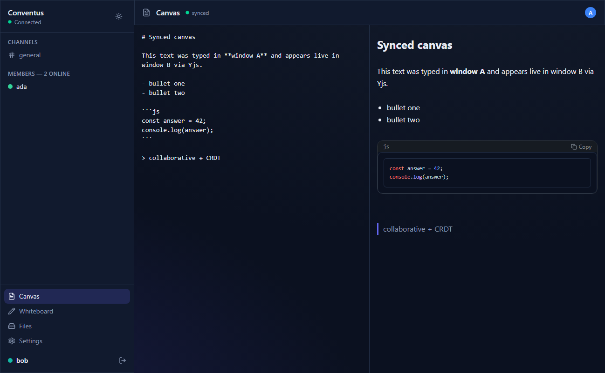
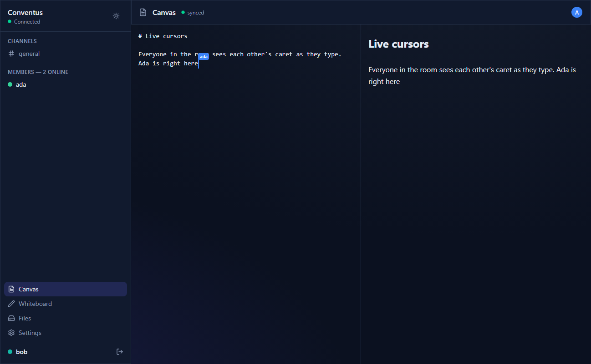
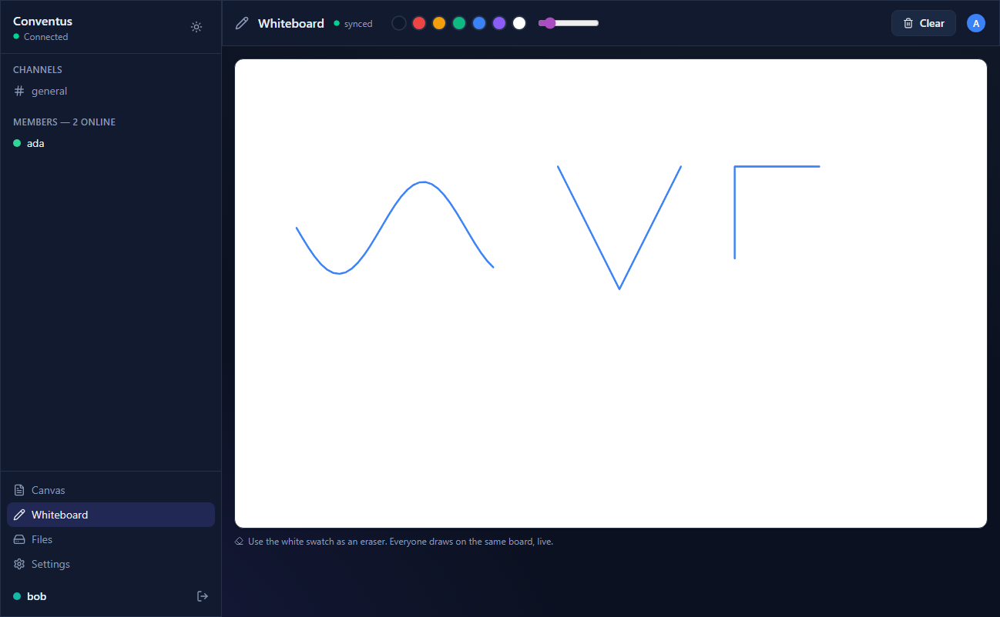
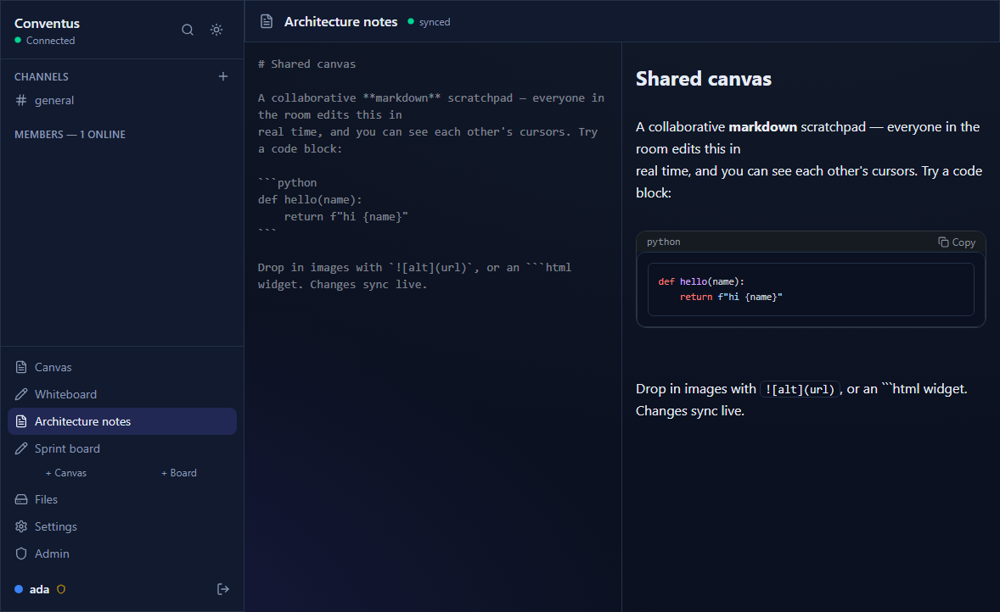

### 🎙️ Call rooms
A board kind that's a **live call** instead of a document — open the **+** menu →
**Call room**. Everyone who joins shares **continuous audio and video**: mics
stay open (no push-to-talk), and because it's built on **WebRTC**, each person's
sound is automatically kept **in sync with their video** (lip-synced).

- **Peer-to-peer.** Media streams directly between participants in a full mesh —
  the server only relays the initial signaling, never the audio or video.
- **Mic & camera controls** — mute/unmute (or hold **Space** to talk while
  muted), and flip your camera on or off anytime.
- **You choose how the room perceives you.** Quality and effects are applied
  **on your device, before anything is sent** — peers just play what arrives:
  a video-quality preset (resolution/framerate/bitrate ceilings), a **dithered
  cam** (the chat's Bayer-duotone lo-fi look, rendered onto a canvas and
  streamed at low res — the raw camera never leaves your machine), and
  **voice presets** (*Full*, *Compressed*, or *Lo-fi radio*, which band-passes
  your mic through a telephone-style WebAudio chain and caps the Opus bitrate).
- **Resizable tiles** with a live **speaking** ring on whoever's talking — bump
  any participant up to 5×.
- **Best for small groups.** A mesh is perfect for a handful of people; a large
  call would want a media server (SFU), which this single-container app
  deliberately doesn't run.
- **Networking.** Works out of the box on most networks via **STUN**. Behind
  strict or symmetric NATs, point it at a **TURN** server with the `TURN_*`
  variables (see [Configuration](#configuration)).

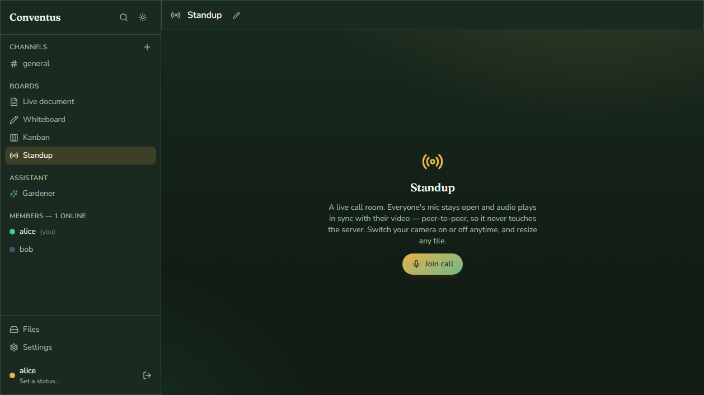
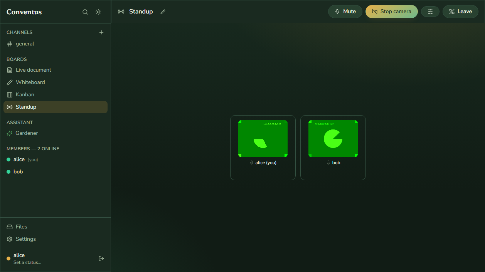
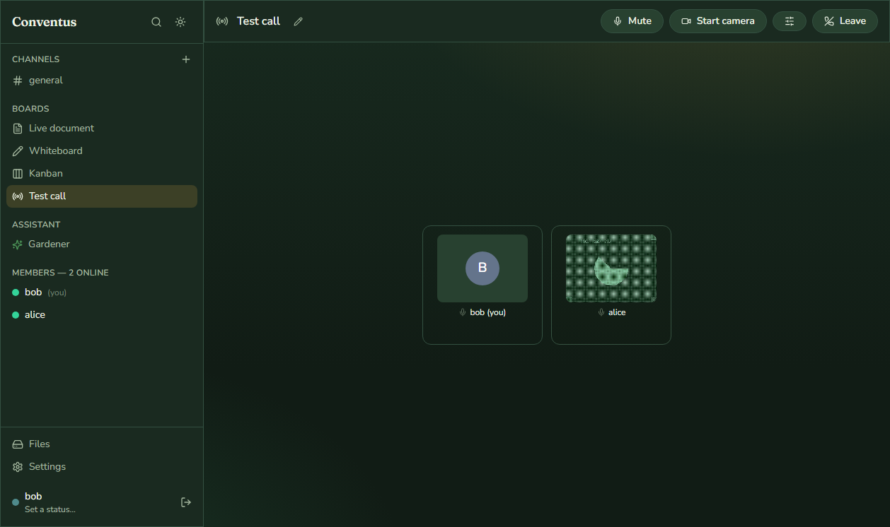

### 🎲 Game boards
A board kind for playing together — the first game is **bingo**. Games have a
**collaborative preparation phase**: the draft lives in the board's shared Yjs
doc, so the whole room writes the word list *together* (live, with remote
cursors) before the host opens play.

- **Draft together** — one word or phrase per line; everyone can add and edit,
  and a counter tracks progress toward a full card (24 words with the FREE
  center square, 25 without).
- **Publish** — the host (the board's creator, or any admin) hits **Open game**:
  the draft is validated and frozen, the game is **announced in the default
  channel**, and everyone playing switches to their card automatically.
- **Play** — each player gets their **own shuffled 5×5 card**, generated
  deterministically from their name (refresh-proof, nothing stored per player).
  Click squares as they happen; the first completed **row, column or diagonal**
  wins — claims are validated server-side, and the winner is announced to the
  room. The host can reset for another round; the draft survives resets.
- **Extensible** — games are a family: one `games` table and one `/api/games`
  router with per-type rules, so new game types plug in beside bingo.

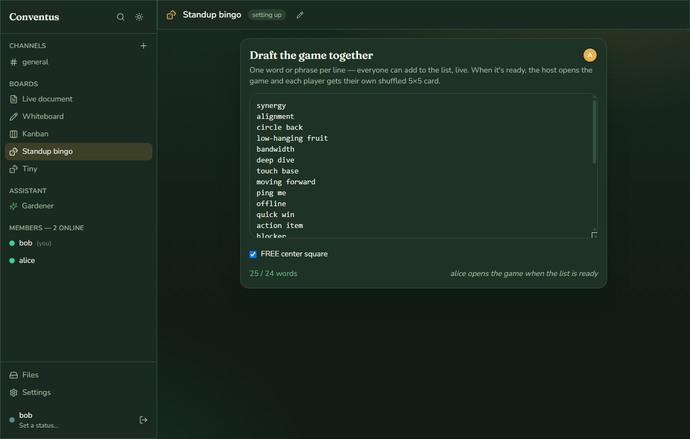
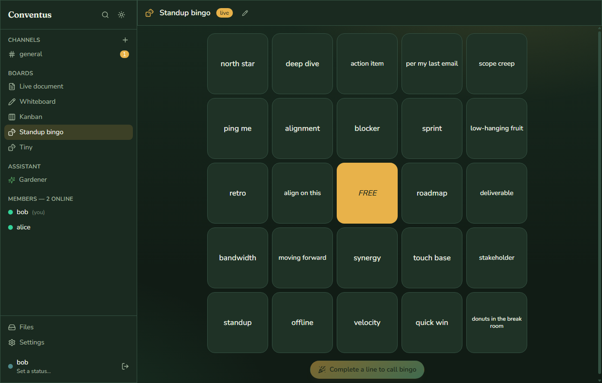

### 🗺️ Map boards
A shared map (**MapLibre GL** under the hood) the whole room annotates together —
pins and paths live in the board's Yjs doc, so they sync in real time exactly
like whiteboard strokes, and they're readable/writable over the REST API too
(bots can drop pins).

- **Pins & paths** — drop pins (labels pop up as bubbles showing the text and
  its author) and click out paths whose **vertices stay visible**; a path's
  writing floats at the shape's center. Click any annotation to relabel,
  recolor, resize or delete it.
- **Freehand drawing & story text** — sketch directly on the map with mouse or
  finger (strokes are geo-anchored, so they stick to the terrain), and place
  big story-style text like on Instagram. Both live in the same shared layer
  set.
- **Images, like a canvas** — upload a photo onto the map; drag it where it
  belongs and resize it from its edit card.
- **A layers menu** — every annotation listed with its author: hide/show any
  of them just for you, zoom to one, or delete it for everyone.
- **Live location, on your terms** — share where you are for **15 minutes, an
  hour, or until you stop**. Positions ride on Yjs *awareness*, which is
  ephemeral by design: your marker exists only while you're sharing and
  vanishes the moment you stop, close the page, or the timer runs out —
  nothing is ever stored. Everyone sharing appears as a named, colored marker
  that moves live.
- **Base map** — vector tiles from [OpenFreeMap](https://openfreemap.org) by
  default (free, keyless; like the STUN default, it's the one external service
  the feature leans on). Pick **Liberty, Bright or Positron** right on the map,
  point `MAP_STYLE_URL` at your own MapLibre style to stay fully
  self-contained, or set a personal style URL in **Settings → Maps**. The
  MapLibre bundle is lazy-loaded only when a map board opens.

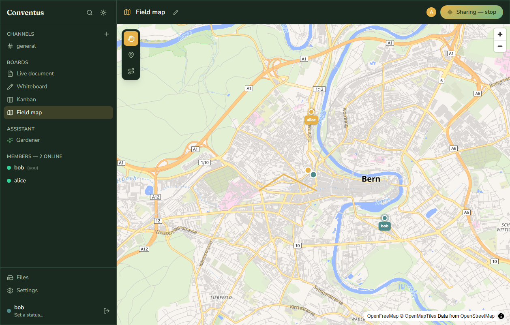
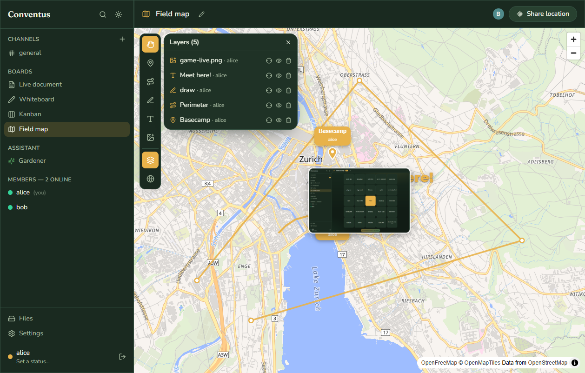

### 🤖 Bots & automation
- **Bots** — wire up any **OpenAI-compatible** endpoint and let an agent live in
  a channel (reply on @mention or every message), with **streaming** replies and
  avatars, editable from the admin panel.
- **Automation API** — the same password-protected REST API powers bots,
  scripts, and scheduled posts.
- **Key handling** — bot API keys are write-only over the API, **encrypted at
  rest** (when `SECRET_KEY` is pinned), and stripped from room exports unless
  you explicitly ask for a full backup. An `api_key` of `env:VAR_NAME` reads
  the key from an environment variable at call time, so the secret never
  touches the database at all.

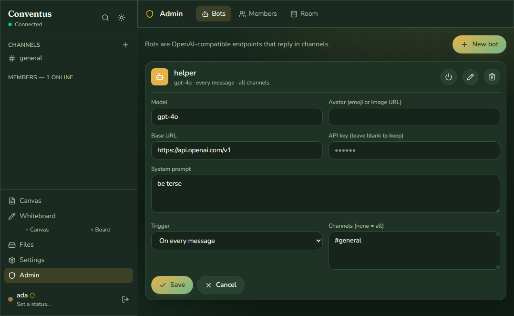

### 🔔 Notifications
**@mention notifications** — desktop + a title-bar badge while the tab is open,
and **Web Push** (via a service worker + VAPID) so subscribers are notified even
when the app is closed. Plus an offline / reconnecting indicator.

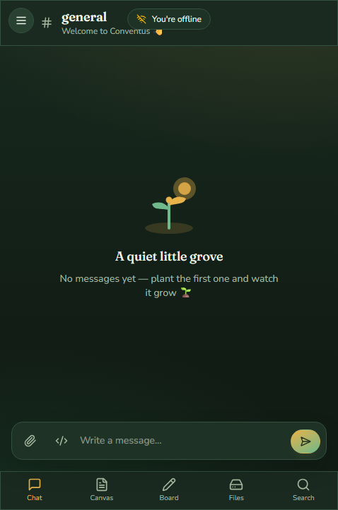

### 🎨 Look & feel
A **solarpunk · Ghibli** design — warm sunlit palette, storybook type, an
illustrated login scene and empty states. **Light & dark themes** plus per-user
**custom CSS** (stored only in your browser) and solarpunk presets.

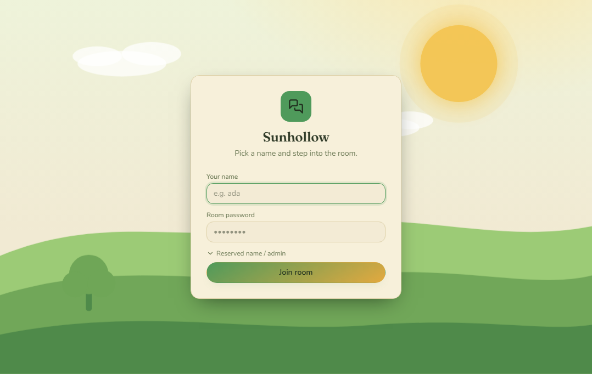
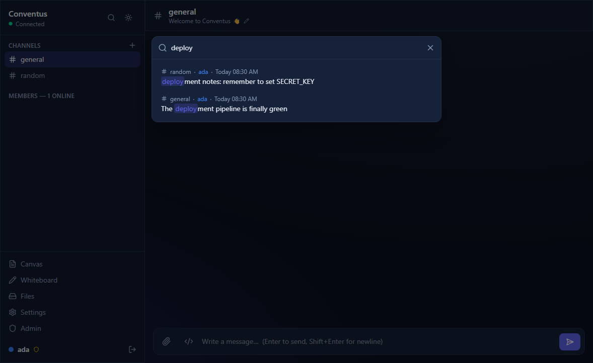
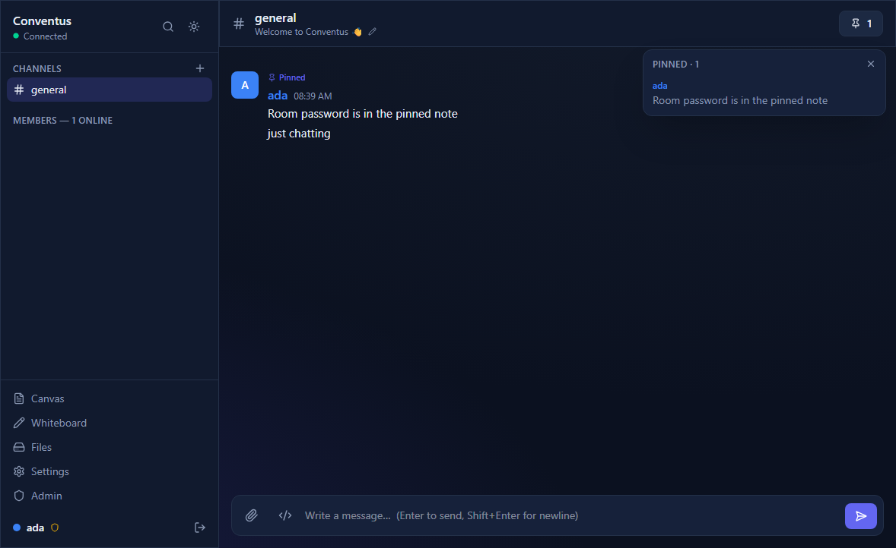

### 📱 Mobile + installable
Fully responsive — a bottom tab bar, touch-friendly actions, safe-area aware —
and **installable as a PWA** (“Add to Home Screen”) with an offline-capable app
shell.

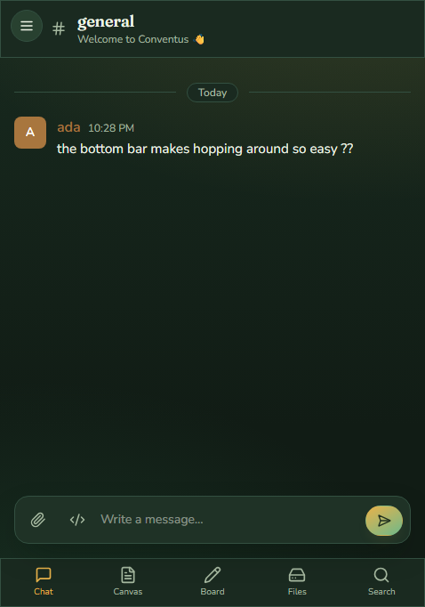
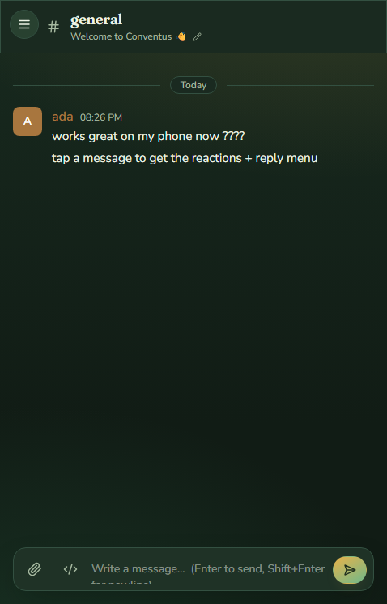
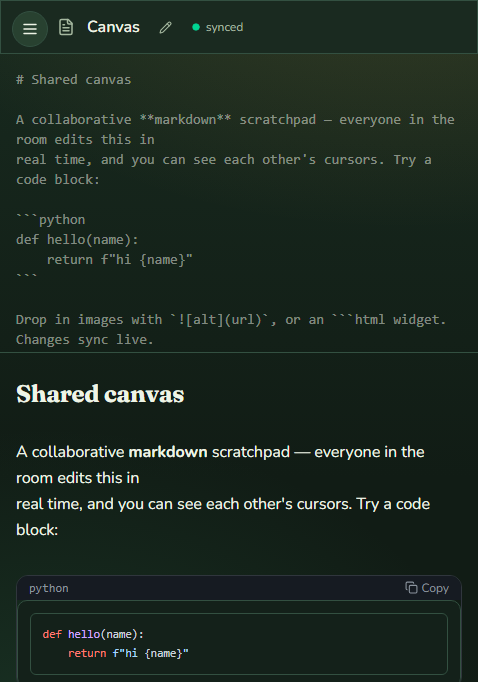
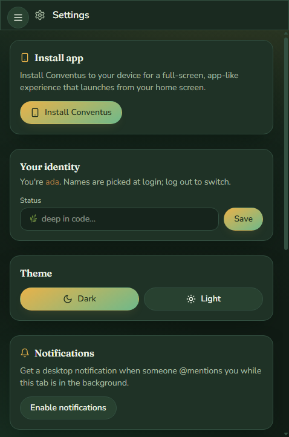

---

## Make it yours — theming & custom CSS

Conventus is built on a small set of CSS variables, so you can restyle it
completely — **for yourself**. Open **Settings → Appearance** and write CSS in
the **Custom CSS** box. It's stored only in your browser's `localStorage` (never
sent to the server), applied live as you type, and it **overrides the active
light/dark theme**, so your tweaks always win.

### Design tokens

Override any of these on `:root`:

| Variable          | Controls                                   |
| ----------------- | ------------------------------------------ |
| `--c-bg`          | App background                             |
| `--c-surface`     | Sidebar / headers                          |
| `--c-surface-2`   | Cards, the composer                        |
| `--c-elevated`    | Buttons, hovered rows                      |
| `--c-border`      | Borders / dividers                         |
| `--c-text`        | Primary text                               |
| `--c-muted`       | Secondary text                             |
| `--c-accent`      | Primary accent (buttons, links, mentions)  |
| `--c-accent-2`    | Secondary accent (gradients)               |
| `--c-accent-soft` | Translucent accent (highlights)            |
| `--c-hover`       | Row-hover overlay                          |
| `--radius`        | Corner roundness                           |
| `--font`          | Body font                                  |
| `--font-display`  | Heading / brand font                       |

### Examples

A punchy orange accent and tighter corners:

```css
:root {
  --c-accent: #ff7a00;
  --c-accent-2: #ffb347;
  --radius: 6px;
}
```

A whole custom palette:

```css
:root {
  --c-bg: #0b0e14;
  --c-surface: #11151f;
  --c-surface-2: #161b27;
  --c-elevated: #1d2433;
  --c-border: #2a3142;
  --c-text: #e8ecf5;
  --c-muted: #8a93a6;
  --c-accent: #7c9cff;
  --c-accent-2: #b08cff;
  --c-accent-soft: #7c9cff2b;
}
```

Custom CSS isn't limited to the tokens — you can target any element, and even
pull in a web font:

```css
@import url("https://fonts.googleapis.com/css2?family=Space+Grotesk&display=swap");
:root { --font: "Space Grotesk", sans-serif; }

.msg-content { font-size: 0.98rem; line-height: 1.7; }
```

> Want a starting point? **Settings → Appearance** ships presets — *Forest,
> Golden Hour, Mossy Glen, Sakura, Twilight* — each in a **dark and a light
> variant**, plus a one-click light / dark toggle. Custom CSS layers on top of
> whichever you pick, and the full CSS for every preset lives in the
> [themes folder](https://github.com/caviri/conventus/tree/main/themes) for
> reference and inspiration.

---

## Architecture

Everything lives in **one container**: FastAPI (uvicorn) serves the JSON API, a
realtime WebSocket, a Yjs collaboration relay, and the built React/Vite SPA as
static files. State is SQLite (WAL) plus uploaded files on disk.

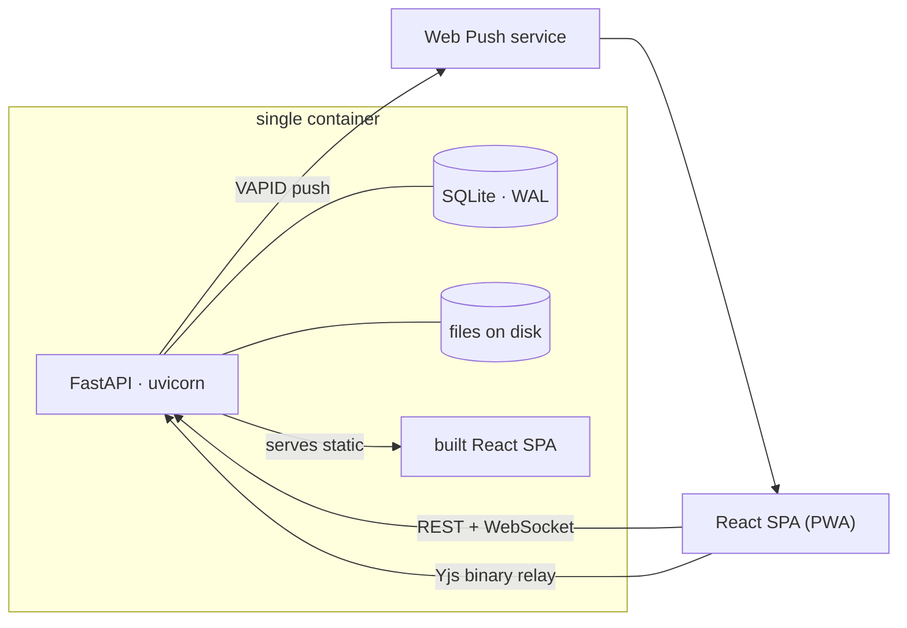
```mermaid
flowchart LR
  subgraph Container["single container"]
    direction LR
    API["FastAPI · uvicorn"]
    DB[("SQLite · WAL")]
    FS[("files on disk")]
    SPA["built React SPA"]
    API --- DB
    API --- FS
    API -->|serves static| SPA
  end
  Browser["React SPA (PWA)"]
  Browser -->|REST + WebSocket| API
  Browser -->|Yjs binary relay| API
  Push["Web Push service"]
  API -->|VAPID push| Push --> Browser
```

### Message lifecycle

Posting a message broadcasts immediately, then post-processes (link previews,
mentions, bots) and broadcasts updates — so the UI feels instant.

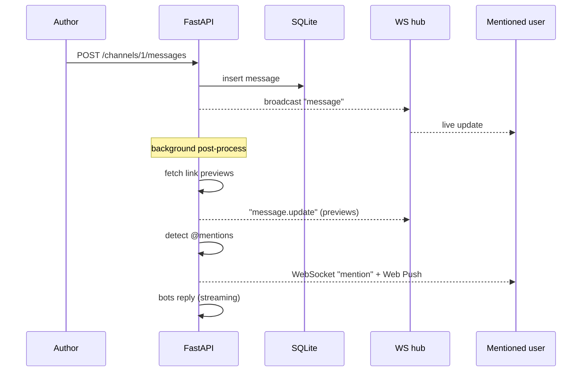
```mermaid
sequenceDiagram
  participant U as Author
  participant API as FastAPI
  participant DB as SQLite
  participant Hub as WS hub
  participant M as Mentioned user
  U->>API: POST /channels/1/messages
  API->>DB: insert message
  API-->>Hub: broadcast "message"
  Hub-->>M: live update
  Note over API: background post-process
  API->>API: fetch link previews
  API-->>Hub: "message.update" (previews)
  API->>API: detect @mentions
  API-->>M: WebSocket "mention" + Web Push
  API->>API: bots reply (streaming)
```

### Collaboration & CRDT compaction

Live documents, whiteboards and kanban boards are Yjs documents. The server is a **persistent relay**:
it stores an append-only log of binary updates and fans them out. When the log
grows past a threshold it asks a client for a full **snapshot** and collapses the
log to a single update, keeping late-joiner sync fast.

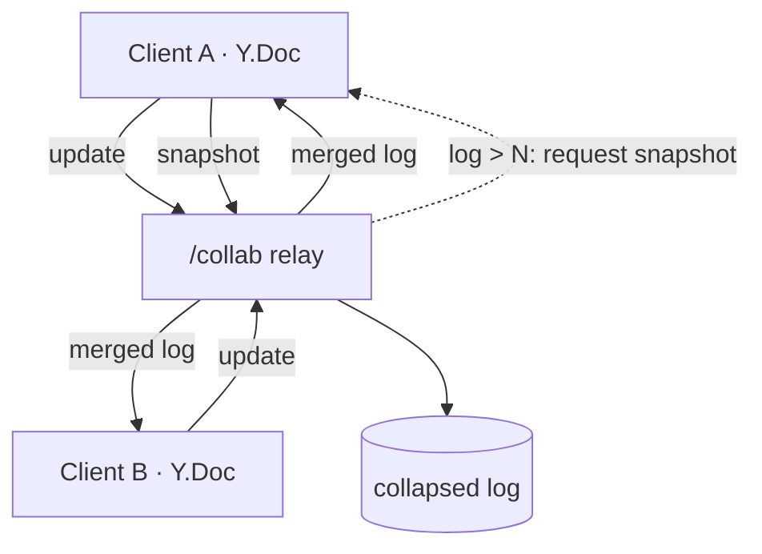
```mermaid
flowchart TB
  A["Client A · Y.Doc"] -- update --> R["/collab relay"]
  B["Client B · Y.Doc"] -- update --> R
  R -- merged log --> A
  R -- merged log --> B
  R -. "log > N: request snapshot" .-> A
  A -- snapshot --> R
  R --> S[("collapsed log")]
```

---

## Tech stack

| Layer        | Tech                                                                   |
| ------------ | ---------------------------------------------------------------------- |
| Frontend     | React 18, Vite, TypeScript, Tailwind v4, Zustand, Yjs, highlight.js    |
| Backend      | FastAPI, uvicorn, SQLite (WAL), itsdangerous, httpx, BeautifulSoup     |
| Realtime     | WebSockets (presence/messages) + a binary Yjs relay (collab) + WebRTC call rooms (signaling relay) |
| Notifications| Web Push (pywebpush + VAPID), a service worker                         |
| Packaging    | Multi-stage Docker (Vite build → FastAPI serves the static SPA)        |

---

## Run it

### Docker

```bash
docker compose up --build
# open http://localhost:7860   (room password: "conventus", admin: "admin")
```

### Hugging Face Spaces

1. Create a new Space → **Docker** SDK.
2. Push this repo. The `app_port: 7860` front matter in the root `README.md` is
   all the config the Space needs.
3. Set `ROOM_PASSWORD`, `ADMIN_PASSWORD` and `SECRET_KEY` as **Space secrets**.
4. (Optional) Enable **persistent storage** so the room survives restarts — it
   mounts at `/data`.

### Configuration

| Variable        | Default     | Purpose                                  |
| --------------- | ----------- | ---------------------------------------- |
| `ROOM_PASSWORD` | `conventus` | Shared password to enter the room        |
| `ADMIN_PASSWORD`| `admin`     | Unlocks the admin panel                  |
| `SECRET_KEY`    | random      | Signs session tokens **and encrypts stored bot API keys** — pin it for stable sessions and at-rest key encryption |
| `ROOM_NAME`     | `Conventus` | Branding in the UI                       |
| `MAX_UPLOAD_MB` | `100`       | Per-file upload limit                    |
| `DATA_DIR`      | `/data`     | DB + uploads location                    |
| `MAP_STYLE_URL` | OpenFreeMap | MapLibre style JSON for map boards (self-host to stay fully contained) |
| `STUN_URLS`     | Google STUN | Comma-separated STUN URLs for call rooms |
| `TURN_URLS`     | _(none)_    | Comma-separated TURN URLs (for strict/symmetric NATs) |
| `TURN_USERNAME` | _(none)_    | TURN credential username                 |
| `TURN_PASSWORD` | _(none)_    | TURN credential password                 |

---

## API reference

Everything the UI does is a documented REST call, so bots, scripts and
scheduled posts use the same surface. **Interactive docs** are served live at
**`/docs`** (Swagger UI) and **`/redoc`**; the raw schema is at `/openapi.json`.

### Authentication

All endpoints except `GET /api/health`, `GET /api/auth/config`,
`POST /api/auth/login` and `GET /api/push/config` need a **bearer token**.
Get one, then send it on every request:

```bash
URL=http://localhost:7860
TOKEN=$(curl -s $URL/api/auth/login -H 'content-type: application/json' \
  -d '{"password":"conventus","name":"poster"}' | jq -r .token)

# Post a message
curl $URL/api/channels/1/messages -X POST \
  -H "Authorization: Bearer $TOKEN" -H 'content-type: application/json' \
  -d '{"content":"Hello from the API 🚀"}'
```

Use the admin password in the same `"password"` field to get an **admin** token
(required by the admin-only endpoints marked 🔒).

### Endpoints

**Auth**

| Method & path           | Body / notes                                   |
| ----------------------- | ---------------------------------------------- |
| `POST /api/auth/login`  | `{password, name}` → `{token, user}`. Password may be room, admin, or reserved-name password. |
| `GET  /api/auth/me`     | Current user                                   |
| `POST /api/auth/protect` | `{password}` — protect your own name with a personal password (login then requires it). Empty password removes the protection. |
| `GET  /api/auth/config` | Public: room name, version + call-room ICE servers (no auth) |

**Channels & messages**

| Method & path                          | Body / notes                          |
| -------------------------------------- | ------------------------------------- |
| `GET    /api/channels`                 | List channels                         |
| `POST   /api/channels`                 | `{name, topic?}`                      |
| `PATCH  /api/channels/{id}` 🔒         | `{name?, topic?}`                     |
| `DELETE /api/channels/{id}` 🔒         | (not the default channel)             |
| `GET    /api/channels/{id}/messages`   | `?before=&limit=` (paginated)         |
| `POST   /api/channels/{id}/messages`   | `{content, attachments?, reply_to?}`  |
| `GET    /api/channels/{id}/pins`       | Pinned messages                       |
| `PATCH  /api/messages/{id}`            | Edit own message `{content}`          |
| `DELETE /api/messages/{id}`            | Author or admin                       |
| `POST   /api/messages/{id}/reactions`  | Toggle `{emoji}`                      |
| `POST   /api/messages/{id}/pin`        | Toggle pinned                         |

**DMs**

| Method & path                     | Body / notes                  |
| --------------------------------- | ----------------------------- |
| `GET  /api/dms`                   | Your conversations            |
| `POST /api/dms`                   | `{with}` → open/get a DM      |
| `GET  /api/dms/{id}/messages`     | `?before=&limit=`             |
| `POST /api/dms/{id}/messages`     | `{content, attachments?, reply_to?}` |

**Members · search · boards · files**

| Method & path                  | Body / notes                                  |
| ------------------------------ | --------------------------------------------- |
| `GET  /api/members`            | Roster with presence, status, avatar          |
| `POST /api/members/status`     | `{status}`                                    |
| `POST /api/members/avatar`     | `{avatar}` (emoji or URL)                     |
| `GET  /api/search?q=`          | Search channels + your DMs                    |
| `GET  /api/boards`             | List boards (live documents, whiteboards, kanban, call rooms, games, maps) |
| `POST /api/boards`             | `{kind, name, game_type?}` (`canvas`/`whiteboard`/`kanban`/`room`/`game`/`map`) |
| `PATCH /api/boards/{id}`       | `{name}`                                       |
| `DELETE /api/boards/{id}` 🔒   | Removes the board + its collab log            |
| `GET  /api/boards/{id}/content`  | Kanban → `{columns, cards}`; live document → `{text}`; map → `{features}` |
| `POST /api/boards/{id}/cards`    | Kanban: add a card `{text, col?, tags?, assignee?, due?, image?, link?}` |
| `POST /api/boards/{id}/columns`  | Kanban: add a column `{title}`                |
| `POST /api/boards/{id}/append`   | Live document: append `{text}`                |
| `POST /api/boards/{id}/features` | Map: add an annotation `{kind: pin·path·draw·text·image, coords, label?, color?, size?, url?}` — live viewers see it instantly |
| `POST /api/files`              | multipart `file=` → metadata                  |
| `GET  /api/files`              | The Drive listing                             |
| `GET  /api/files/{id}/raw`     | Stream a file (`?download=true` to download)  |
| `DELETE /api/files/{id}`       | Uploader or admin                             |

**Games** (boards of kind `game`; the host is the board's creator or an admin)

| Method & path                   | Body / notes                                  |
| ------------------------------- | --------------------------------------------- |
| `GET  /api/games/{id}`          | State: `{game_type, status: setup·live·done, winner, created_by, config, is_host}` |
| `GET  /api/games/{id}/setup`    | The collaborative draft `{text, options}` (same data live editors see via Yjs) |
| `PUT  /api/games/{id}/setup`    | Write the draft `{text?, options?}` — anyone; it's collaborative |
| `POST /api/games/{id}/publish`  | Host: validate + freeze the draft, go live, announce in chat |
| `GET  /api/games/{id}/view`     | Your private view — bingo: your 25 `{text, free}` cells |
| `POST /api/games/{id}/win`      | Claim a win `{data: {marked: [i, …]}}` — validated server-side |
| `POST /api/games/{id}/reset`    | Host: back to setup for another round (the draft survives) |

**Bots · push · admin**

| Method & path                  | Body / notes                                  |
| ------------------------------ | --------------------------------------------- |
| `GET  /api/bots`               | List bots (keys masked; `env:` refs shown)    |
| `POST /api/bots` 🔒            | `{name, base_url, api_key?, model, system_prompt?, trigger, channels?, avatar?}` — `api_key` may be `env:VAR_NAME` to read it from the environment at call time |
| `PATCH /api/bots/{id}` 🔒      | Any of the above (blank `api_key` keeps it)   |
| `DELETE /api/bots/{id}` 🔒     | Delete a bot                                  |
| `GET  /api/push/config`        | VAPID public key (no auth)                    |
| `POST /api/push/subscribe`     | `{subscription}`                              |
| `POST /api/push/unsubscribe`   | `{endpoint}`                                  |
| `POST /api/admin/reserve` 🔒   | `{name, password, is_admin?}`                 |
| `DELETE /api/admin/members/{name}` 🔒 | Remove a member                        |
| `POST /api/admin/export` 🔒    | Download the room as a zip. Bot API keys are **stripped by default**; add `?include_secrets=true` for a full backup (the zip then holds usable plaintext keys — guard it) |
| `POST /api/admin/import` 🔒    | multipart `file=` (a previous export). Bots imported without keys keep the keys this room already has |

> 🔒 = requires an admin token. The same token authorizes the realtime
> `/ws?token=…` (presence + messages), `/collab/{doc}?token=…` (Yjs), and
> `/voice/{room}?token=…` (WebRTC call-room signaling) sockets.

---

## Building bots & agents

There are two ways to put an LLM in a room, and they answer different needs.

| | **A · Built-in bot** | **B · Your own agent** |
| --- | --- | --- |
| Where it runs | Inside the Conventus server | Any process that can reach the API |
| You write | Nothing — just config | A small script |
| Good for | "Drop an OpenAI-compatible persona in a channel" | Tools, retrieval, multi-step logic, your own framework (e.g. **PydanticAI**) |

Both talk to the **same** OpenAI-compatible chat API on one side and the **same**
Conventus REST API on the other — there's no special "bot account". A bot is
just a user with a name and a token.

### Option A — A built-in bot (no code)

Conventus can call any **OpenAI-compatible** `/chat/completions` endpoint for
you. Add a bot from the **admin panel**, or with one admin call:

```bash
URL=http://localhost:7860
ADMIN_TOKEN=$(curl -s $URL/api/auth/login -H 'content-type: application/json' \
  -d '{"password":"admin","name":"admin"}' | jq -r .token)

curl $URL/api/bots -X POST -H "Authorization: Bearer $ADMIN_TOKEN" \
  -H 'content-type: application/json' -d '{
    "name": "helper",
    "base_url": "https://api.openai.com/v1",
    "api_key": "sk-…",
    "model": "gpt-4o-mini",
    "system_prompt": "You are a concise, friendly room assistant.",
    "trigger": "mention",
    "channels": []
  }'
```

- **`base_url`** is anything that speaks the OpenAI protocol — OpenAI, Together,
  Groq, or a local **Ollama** / **LM Studio** / **vLLM** at e.g.
  `http://localhost:11434/v1`.
- **`trigger`** is `mention` (only replies when its name appears) or `all`
  (replies to every message). **`channels`** is a list of channel ids, or `[]`
  for every channel.
- The server streams the answer token-by-token (you watch it type), and feeds
  the **last ~20 messages** of the channel as context. Bots never reply to other
  bots, so they can't loop.

That's the whole setup — no process to run, nothing to keep alive.

### Option B — Your own agent over the API (PydanticAI)

Reach for this when you want more than a chat persona: tools/function-calling,
retrieval, memory, or any orchestration framework. Your agent is just an API
client that **logs in → watches messages → posts replies**. Here's a complete
one built on [PydanticAI](https://ai.pydantic.dev), named `BOT_AGENT`:

```python
# pip install pydantic-ai httpx
import asyncio, os, httpx
from pydantic_ai import Agent
from pydantic_ai.models.openai import OpenAIModel
from pydantic_ai.providers.openai import OpenAIProvider

# --- Conventus connection ---
CONVENTUS_URL = os.environ.get("CONVENTUS_URL", "http://localhost:7860")
ROOM_PASSWORD = os.environ["CONVENTUS_PASSWORD"]      # room (or reserved-name) password
BOT_NAME      = os.environ.get("BOT_NAME", "pybot")
CHANNEL_ID    = int(os.environ.get("CHANNEL_ID", "1"))

# --- The model (any OpenAI-compatible endpoint) ---
BOT_AGENT = Agent(
    OpenAIModel(
        os.environ.get("MODEL", "gpt-4o-mini"),
        provider=OpenAIProvider(
            base_url=os.environ.get("OPENAI_BASE_URL", "https://api.openai.com/v1"),
            api_key=os.environ["OPENAI_API_KEY"],
        ),
    ),
    system_prompt="You are pybot, a concise, friendly helper living in a chat room.",
)

async def main():
    async with httpx.AsyncClient(base_url=CONVENTUS_URL, timeout=60) as http:
        # 1. Log in like any user — the returned token authorizes every call.
        r = await http.post("/api/auth/login",
                            json={"name": BOT_NAME, "password": ROOM_PASSWORD})
        r.raise_for_status()
        http.headers["Authorization"] = f"Bearer {r.json()['token']}"

        # 2. Start from "now" so we only answer messages that arrive after launch.
        seen = await http.get(f"/api/channels/{CHANNEL_ID}/messages",
                              params={"limit": 50})
        last_id = max((m["id"] for m in seen.json()), default=0)
        print(f"{BOT_NAME} listening on channel {CHANNEL_ID}…")

        # 3. Poll for new messages, answer the ones addressed to us.
        while True:
            await asyncio.sleep(2)
            rows = (await http.get(f"/api/channels/{CHANNEL_ID}/messages",
                                   params={"limit": 50})).json()
            for m in sorted(rows, key=lambda x: x["id"]):
                if m["id"] <= last_id:
                    continue
                last_id = m["id"]
                # Skip our own + system/bot lines (prevents loops), gate on mention.
                if m["author"] == BOT_NAME or m["kind"] != "text":
                    continue
                if BOT_NAME.lower() not in m["content"].lower():
                    continue
                result = await BOT_AGENT.run(m["content"])
                await http.post(f"/api/channels/{CHANNEL_ID}/messages",
                                json={"content": result.output, "reply_to": m["id"]})

asyncio.run(main())
```

```bash
export CONVENTUS_PASSWORD=conventus OPENAI_API_KEY=sk-…
python bot_agent.py
```

> PydanticAI moves fast: on older versions read `result.data` instead of
> `result.output`, and the model class may be `OpenAIChatModel`.

A few notes:

- **It runs anywhere** — on the server box, in a sidecar container, or your
  laptop — it only needs to reach `CONVENTUS_URL`. Keep it alive with systemd,
  a container `restart: always`, or a `while` wrapper.
- **Reserve the name** so nobody else can log in as your bot: an admin calls
  `POST /api/admin/reserve {name, password}`, then set `CONVENTUS_PASSWORD` to
  that password. Give it an avatar/colour via `POST /api/members/avatar`.
- **Tools & memory** are just PydanticAI features — add `@BOT_AGENT.tool`
  functions (search the Drive, hit `GET /api/search`, call your own services)
  and PydanticAI will let the model call them before it answers.
- **Want it instant instead of polling?** Connect to `ws(s)://<host>/ws?token=…`
  and react to `{"event":"message","data":{…}}` frames — the same socket the UI
  uses — instead of the 2-second poll. Polling is simpler and perfectly fine to
  start.
- **DMs work the same** — swap the channel endpoints for `GET/POST
  /api/dms/{id}/messages` (open one first with `POST /api/dms {with}`), so you
  can have a private 1:1 agent.

**Which should I use?** If you just want an LLM to chat in a channel, use a
built-in bot — it's zero-maintenance and streams. If you need it to *do things*
(call tools, look things up, follow your own logic), write an agent with Option
B.

---

*Built as a disposable, joyful little gathering place. MIT licensed — do whatever.* 🌿
